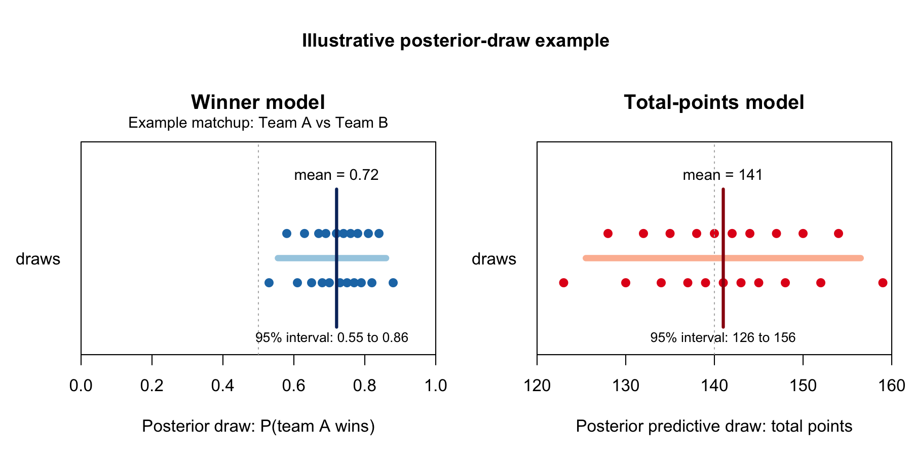

# Methods and Interpretation Guide

## Scope

This document describes the active `mmBayes` runtime as implemented in:

- `R/data_refresh.R`
- `R/data_loading.R`
- `R/model_fitting.R`
- `R/simulation_functions.R`
- `R/utils.R`
- `R/model_quality.R`
- `R/plotting_functions.R`

It is meant to answer four questions clearly:

1. where the data come from
2. how raw scraped data are turned into modeling tables
3. what the Bayesian models actually are, including priors and notation
4. how posterior draws become bracket picks, decision scores, and exported files

## Operational Entrypoints

The repo has four different command-line entrypoints for simulation and dashboard output, and they are not interchangeable:

- `Rscript scripts/run_simulation.R` is the authoritative full pipeline. It fits the models, optionally runs the rolling backtest, simulates the bracket, generates candidates, writes the full output bundle including the saved results RDS, and syncs the tracked repo dashboard HTML snapshot under `output/`.
- `Rscript scripts/run_bracket_candidates.R` is a lighter rerun for bracket outputs when you do not want the full backtest, but it still reloads or refits models and regenerates bracket candidates. It is not a render-only command.
- `Rscript scripts/regenerate_and_sync_dashboards.R` is the preferred command for dashboard/UI iteration. It loads the saved full results bundle, regenerates only the dashboard HTML files, and syncs the tracked repo `output/` HTML copies without rerunning simulation.
- `Rscript scripts/publish_github_pages.R` is internal plumbing. It only copies already-rendered dashboard HTML into the tracked repo `output/` directory. It does not regenerate dashboards and is not a normal operator command.

Use the render-only path when the cached full results bundle is already valid and you only changed dashboard code or documentation-linked HTML output.

## End-to-End Pipeline

At a high level, the workflow is:

1. scrape season-level team data and tournament results
2. normalize team names and validate the tournament field
3. build historical matchup-level training rows
4. fit a Bayesian logistic regression for game winners
5. fit a Bayesian Gaussian model for total points
6. draw posterior predictions for each matchup in the current bracket
7. simulate the bracket forward round by round
8. rank and export bracket candidates plus review artifacts
9. score any completed current-year games for live monitoring only, without feeding those outcomes back into model fitting or bracket generation

The project is matchup-based. It does not fit a team-level "who wins the title?" target directly. Instead, it estimates game-level probabilities and then propagates them through the bracket.

The core winner model and championship total-points model do not require betting inputs. On `master`, betting-line experimentation is not part of the supported workflow.
Current-year monitoring outcomes are deliberately separated from prediction-time inputs: only First Four results affect bracket-path resolution, while completed Round of 64+ games are used for live evaluation and commentary only.
Runtime artifacts that are not explicitly listed by `release_deliverable_manifest()` are scratch outputs rather than part of the release contract.

## Betting Status

Betting-line work is parked on the `betting-lines-spike` branch. The active guidance on `master` is the betting-free pipeline documented in this file.

## Source Data

### Scraped sources

The canonical data refresh in `update_tournament_data()` pulls from these sources:

| Canonical output | Function | Source | URL pattern | Purpose |
| --- | --- | --- | --- | --- |
| `data/pre_tournament_team_features.xlsx` under the configured synced project home | `scrape_bart_data()` | Bart Torvik season ratings | `https://barttorvik.com/?year={year}&...` | Pre-tournament team metrics and conference labels |
| `data/pre_tournament_team_features.xlsx` under the configured synced project home | `scrape_historical_tournament_roster()` | Sports-Reference NCAA bracket page | `https://www.sports-reference.com/cbb/postseason/men/{year}-ncaa.html` | Completed historical tournament field, seeds, and regions |
| `data/pre_tournament_team_features.xlsx` under the configured synced project home | `scrape_conf_assignments()` | Bart Torvik Tourney Time | `https://barttorvik.com/tourneytime.php?year={year}&sort=7&conlimit=All` | Current bracket-year tournament field, seeds, regions, conferences |
| `data/tournament_game_results.xlsx` under the configured synced project home | `scrape_tournament_results()` | Sports-Reference NCAA bracket page | `https://www.sports-reference.com/cbb/postseason/men/{year}-ncaa.html` | Historical completed tournament game results and scores |
| `data/tournament_game_results.xlsx` under the configured synced project home | `scrape_espn_tournament_results()` | ESPN scoreboard API | `https://site.api.espn.com/apis/site/v2/sports/basketball/mens-college-basketball/scoreboard?...` | Current-year completed-game fallback when Sports-Reference is incomplete |

Bart Torvik is the pre-tournament metrics source. Completed historical tournament-field construction comes from Sports-Reference, while the current bracket-year field still comes from Bart Torvik Tourney Time. Completed current-year tournament outcomes are allowed in the canonical results workbook for live monitoring, but they are not fed back into the current bracket fit or the pre-tournament matchup features. Only current-year First Four results affect bracket-path resolution.

### What gets written to disk

The refresh writes exactly two canonical files:

- `data/pre_tournament_team_features.xlsx` under the configured synced project home
- `data/tournament_game_results.xlsx` under the configured synced project home

Those two files are the only data inputs used by the active modeling runtime.

## Data Standardization and Validation

### Team name reconciliation

Different sources do not always use the same display name for the same school. The pipeline standardizes names through:

- `raw_team_name_key()`
- `team_name_aliases()`
- `canonicalize_team_name()`
- `normalize_team_key()`

Examples include:

- `UConn` -> `Connecticut`
- `Saint John's` variants -> `Saint John's`
- `Ole Miss` -> `Mississippi`

This alias layer is important because every historical result row must join back to pre-tournament team features.

### Tournament roster checks

`validate_tournament_roster()` enforces structural assumptions about the field:

- exactly 68 teams per year
- each region contains 16 to 18 listed teams before play-in resolution
- exactly four duplicate seed slots per year for the First Four
- duplicate seed slots must be pairs, not triples or other counts

### Canonical result checks

`validate_game_results()` enforces:

- `winner` must equal that row's `teamA` or `teamB`
- score columns must be both present or both missing
- `total_points` must equal `teamA_score + teamB_score` when scores exist
- the listed winner must match the higher score when scores exist
- tied scored rows are rejected as invalid canonical tournament inputs
- current-year completed rows are allowed in any round as long as they pass the same score-integrity and team-resolution checks

### Scoring guardrails

`score_bracket_against_results()` requires `Year` in actual results and uses `Year + region + round + game_index` as the game identity. This prevents multi-year or duplicate actual-result tables from silently inflating bracket scores.

### Leakage control

The model is intentionally restricted to pre-tournament information. `strip_leakage_columns()` removes post-tournament or obviously leakage-prone columns such as:

- `R64`
- `R32`
- `S16`
- `E8`
- `F4`
- `F2`
- `Champ`
- `Clutch_Index`
- `Conf_Strength`
- `historical_performance`

The goal is to model what could have been known before the bracket started.

## Team-Level Features

### Raw season features

The active allowed season features are:

- `Barthag`
- `AdjOE`
- `AdjDE`
- `WAB`
- `TOR`
- `TORD`
- `ORB`
- `DRB`
- `3P%`
- `3P%D`
- `Adj T.`

In the active runtime, the model actually uses `barthag_logit` rather than raw `Barthag`.

### Safe derived feature

`add_safe_pre_tournament_features()` creates:

$$
\text{barthagLogit} = \log\left(\frac{\text{Barthag}}{1-\text{Barthag}}\right)
$$

after clipping `Barthag` into the open interval `(10^{-9}, 1 - 10^{-9})` to avoid infinite values.

This is a standard logit transform. It converts a probability-like quantity into an unbounded real-valued predictor.

## Historical Training Rows

### One game becomes one matchup row

The winner model is trained on historical NCAA tournament games. For each completed game, the runtime:

1. joins team A to its pre-tournament features
2. joins team B to its pre-tournament features
3. computes matchup-level features such as `seed_diff` and `AdjOE_diff`
4. creates the binary outcome `actual_outcome`

The outcome is:

$$
y_i =
\begin{cases}
1 & \text{if team A won game } i \\
0 & \text{if team B won game } i
\end{cases}
$$

### Symmetry by row reversal

`build_explicit_matchup_history()` duplicates every historical game with team order reversed.

If the original row is:

- `teamA = Duke`
- `teamB = Houston`
- `actual_outcome = 1`

then the reversed row becomes:

- `teamA = Houston`
- `teamB = Duke`
- `actual_outcome = 0`

and every signed difference flips sign:

$$
\text{featureDiff}_{B,A} = -\text{featureDiff}_{A,B}
$$

This makes the training design approximately symmetric with respect to team labeling.

## Matchup Feature Engineering

### Winner-model predictors

The active required predictor set from `default_project_config()` is:

- `round`
- `same_conf`
- `seed_diff`
- `barthag_logit_diff`
- `AdjOE_diff`
- `AdjDE_diff`
- `WAB_diff`
- `TOR_diff`
- `TORD_diff`
- `ORB_diff`
- `DRB_diff`
- `3P%_diff`
- `3P%D_diff`
- `Adj T._diff`

These are built by `build_matchup_feature_row()`.

### Exact definitions

For a matchup between team A and team B:

| Predictor | Definition |
| --- | --- |
| `round` | Categorical round label |
| `same_conf` | `1` if `Conf_A == Conf_B`, else `0` |
| `seed_diff` | `Seed_A - Seed_B` |
| `barthag_logit_diff` | `barthag_logit_A - barthag_logit_B` |
| `AdjOE_diff` | `AdjOE_A - AdjOE_B` |
| `AdjDE_diff` | `AdjDE_A - AdjDE_B` |
| `WAB_diff` | `WAB_A - WAB_B` |
| `TOR_diff` | `TOR_A - TOR_B` |
| `TORD_diff` | `TORD_A - TORD_B` |
| `ORB_diff` | `ORB_A - ORB_B` |
| `DRB_diff` | `DRB_A - DRB_B` |
| `3P%_diff` | `3P%_A - 3P%_B` |
| `3P%D_diff` | `3P%D_A - 3P%D_B` |
| `Adj T._diff` | `Adj T._A - Adj T._B` |

### Sign interpretation

Most difference columns are intuitive:

- positive `AdjOE_diff` means team A had the stronger offense by this metric
- positive `WAB_diff` means team A had the better resume by this metric

`seed_diff` is the important exception:

$$
\text{seedDiff} = \text{Seed}_A - \text{Seed}_B
$$

Since lower numeric seeds are better, a negative `seed_diff` usually favors team A.

Example:

- team A is a `3` seed
- team B is a `10` seed
- `seed_diff = 3 - 10 = -7`

So a negative value here often means "team A is better seeded."

## Scaling

Continuous matchup-difference predictors are standardized by `prepare_model_data()` using training-data-only means and standard deviations:

$$
z_{ij} = \frac{x_{ij} - \mu_j}{s_j}
$$

where:

- `x_{ij}` is predictor `j` for game `i`
- `\mu_j` is the training-set mean for predictor `j`
- `s_j` is the training-set standard deviation for predictor `j`

Important details:

- the scaling reference is built only from the training data
- the same scaling reference is reused at prediction time
- `round` and `same_conf` are not standardized

This means the logistic model coefficients for continuous predictors are interpretable per one training-set standard deviation increase in the corresponding team-A minus team-B difference.

## Winner Model

### Model engine

`mmBayes` supports two interchangeable Bayesian engines for producing per-game win probabilities:

- `stan_glm` (default): Bayesian logistic regression via `rstanarm::stan_glm()`.
- `bart`: Bayesian additive regression trees via `BART::pbart()`.

Both engines ultimately produce a **draw-by-game matrix** of posterior win probabilities, and everything downstream (bracket simulation, candidate generation, decision-sheet uncertainty tiers) consumes those draws in the same way.

When using `bart`, the draw budget is controlled by `config$model$bart$n_post` (the number of post-burn-in draws stored by BART).

### Likelihood (when `engine: stan_glm`)

When `engine` is `stan_glm` (the default in `default_project_config()`), the game-winner model in `fit_tournament_model()` is Bayesian logistic regression fit with `rstanarm::stan_glm(..., family = binomial(link = "logit"))`.

For game `i`, the full model is:

$$
y_i \sim \text{Bernoulli}(p_i)
$$

$$
\text{logit}(p_i) = \eta_i
$$

$$
\begin{aligned}
\eta_i &= \alpha \\
&\quad + \gamma_{\text{round}}(r_i) \\
&\quad + \beta_1 \cdot \text{sameConf}_i \\
&\quad + \beta_2 \cdot z(\text{seedDiff}_i) \\
&\quad + \beta_3 \cdot z(\text{barthagLogitDiff}_i) \\
&\quad + \beta_4 \cdot z(\text{AdjOEDiff}_i) \\
&\quad + \beta_5 \cdot z(\text{AdjDEDiff}_i) \\
&\quad + \beta_6 \cdot z(\text{WABDiff}_i) \\
&\quad + \beta_7 \cdot z(\text{TORDiff}_i) \\
&\quad + \beta_8 \cdot z(\text{TORDDiff}_i) \\
&\quad + \beta_9 \cdot z(\text{ORBDiff}_i) \\
&\quad + \beta_{10} \cdot z(\text{DRBDiff}_i) \\
&\quad + \beta_{11} \cdot z(\text{ThreePointPctDiff}_i) \\
&\quad + \beta_{12} \cdot z(\text{ThreePointPctDefDiff}_i) \\
&\quad + \beta_{13} \cdot z(\text{AdjTempoDiff}_i)
\end{aligned}
$$

### What `logit` means

The logit link is:

$$
\text{logit}(p) = \log\left(\frac{p}{1-p}\right)
$$

This is the same as log-odds.

Definitions:

- probability: `p`
- odds: `p / (1 - p)`
- log-odds: `log(p / (1 - p))`

Examples:

- if `p = 0.50`, odds are `1`, and log-odds are `0`
- if `p = 0.75`, odds are `3`, and log-odds are `log(3)`
- if `p = 0.25`, odds are `1/3`, and log-odds are `log(1/3)`

The inverse logit maps the linear predictor back to probability:

$$
p_i = \frac{1}{1 + e^{-\eta_i}}
$$

When `engine` is `bart`, the runtime uses `BART::pbart()` to learn a nonlinear Bernoulli probability surface instead of an explicit logit-linear formula, but the downstream exported summaries (`mean`, intervals, SD, candidate scoring) are computed from the same draw-by-game probability matrix interface.

### Priors

The implemented priors from `configure_priors()` are:

$$
\beta_j \sim \mathcal{N}(0, 1.5^2)
$$

for all fixed-effect coefficients, and

$$
\alpha \sim \mathcal{N}(0, 2.5^2)
$$

for the intercept, passed to `rstanarm` with `autoscale = TRUE`.

In code, that is:

- `rstanarm::normal(0, 1.5, autoscale = FALSE)` for fixed effects
- `rstanarm::normal(0, 2.5, autoscale = TRUE)` for the intercept

### Regularized horseshoe prior (optional)

Setting `prior_type = "hs"` in the model configuration switches the fixed-effect prior to a regularized horseshoe:

$$
\beta_j \sim \text{Regularized Horseshoe}(\text{df}=1, \text{dfGlobal}=1, \text{globalScale}=0.01, \text{slabDf}=4, \text{slabScale}=2.5)
$$

The horseshoe is a heavy-tailed shrinkage prior.  Coefficients whose signal is weak are shrunk aggressively toward zero; large coefficients are left relatively unshrunk.  This is useful here because the 14-predictor design matrix contains several highly correlated efficiency metrics.  It helps the model focus on the few predictors with the clearest signal and may reduce overconfident probability estimates for hard-to-call games (e.g. mid-major upsets where seed differentials are deceptive).

To enable horseshoe priors, set the following in `config.yml`:

```yaml
model:
  prior_type: "hs"
```

### How to interpret the priors

These are weakly informative shrinkage priors.

- Centered at `0` means the prior does not assume an effect direction before seeing the data.
- A coefficient prior around `0` on the log-odds scale means "no effect" is the default.
- Standardized predictors make the coefficient scale more comparable across features.

For a one-standard-deviation increase in a predictor, a coefficient of `\beta` changes the odds by a multiplicative factor of:

$$
e^\beta
$$

So:

- `\beta = 0` means no odds change
- `\beta = 0.69` means about `2x` higher odds
- `\beta = -0.69` means about `0.5x` odds

Because the prior standard deviation is `1.5`, the model allows meaningful effects but still shrinks implausibly large coefficients back toward zero unless the data support them.

### Interaction terms (Stan GLM only)

Setting `interaction_terms` in the model configuration adds interaction terms to the `stan_glm` formula. These are appended verbatim to the right-hand side of the `stan_glm` formula in the same syntax as base R formulas.

Example: to let the effect of overall quality differential vary by round, add:

```yaml
model:
  interaction_terms:
    - "barthag_logit_diff:round"
    - "seed_diff:round"
```

These two interactions capture that the predictive value of team-quality and seeding differences is not constant across rounds.  In early-round matchups (Round of 64, Round of 32), large seed differentials are common but a wider fraction of upsets occur because weaker teams are simply underestimated.  In later rounds the field is leveled and the same quality gap carries different meaning.

The interaction terms receive the same `prior_type` prior as the other fixed effects.

This repo's BART implementation does not accept explicit `interaction_terms`. When comparing `stan_glm` to BART, the comparison uses the same base predictors for both engines, while BART learns interaction structure implicitly through tree splits.

### Round handling

`round` is fit as a factor using the ordered levels returned by `round_levels()`:

- `First Four`
- `Round of 64`
- `Round of 32`
- `Sweet 16`
- `Elite 8`
- `Final Four`
- `Championship`

In practice this means the model includes round offsets rather than treating round as a numeric variable. The exact coefficient parameterization is handled by R's factor encoding inside `stan_glm`.

## Posterior Prediction for Winners

### How posterior draws work

The fitted model does not produce one fixed answer for a matchup. It produces a posterior distribution over the model parameters, and then the runtime propagates that uncertainty forward into matchup-specific quantities.

The figure below is an illustrative example, not an actual bracket matchup. Each dot is one posterior draw from a plausible version of the fitted model. The dark line is the mean, and the light bar is the 95% posterior interval.



In practice, this works like running the same matchup through many slightly different versions of the fitted model:

1. fit the model once on the historical games
2. sample one plausible coefficient set from the posterior
3. plug the matchup features into that coefficient set
4. get one implied win probability for team A
5. repeat hundreds or thousands of times

If one draw says `0.68`, another says `0.74`, and another says `0.71`, the output is not trying to pick one of those as the "true" answer. It is summarizing the whole cloud of plausible answers. The mean is the center of that cloud, and the posterior interval shows how wide it is. On the left panel in the figure, draws clustered above `0.50` mean the model is leaning toward team A; on the right panel, the realized total points cluster around the center but still vary because game-to-game scoring noise remains.

### What is drawn

For a new matchup row, `predict_matchup_rows()` calls:

- `rstanarm::posterior_epred()`

This returns posterior draws of the expected win probability for team A:

$$
p_i^{(1)}, p_i^{(2)}, \ldots, p_i^{(S)}
$$

where each draw corresponds to one posterior draw of the fitted model parameters.

In other words, if the model is fit with `S` posterior draws, then draw `s` gives one plausible set of coefficients, one implied linear predictor $\eta_i^{(s)}$, and one implied win probability $p_i^{(s)}$. The collection $\{p_i^{(1)}, p_i^{(2)}, \ldots, p_i^{(S)}\}$ is the posterior for the win probability itself.

That is why the output can say something like "team A is 72% likely to win" while also showing a 95% posterior interval. The 72% is the center of the sampled probabilities, and the interval is the range most of those plausible model versions land in.

### What gets summarized

`calculate_win_probabilities()` reduces those draws to:

- `mean = mean(draws)`
- `ci_lower = 2.5%` posterior quantile
- `ci_upper = 97.5%` posterior quantile
- `sd =` posterior standard deviation

So if the output says:

- `win_prob_A = 0.72`
- `ci_lower = 0.61`
- `ci_upper = 0.82`

that means the posterior mean win probability for team A is `72%`, and the central `95%` posterior interval for that probability is about `61%` to `82%`.

## Total-Points Model

The project also fits a separate total-points model for tiebreaker support and matchup-level scoring summaries.

As with the winner model, the total-points model can be fit with:

- `stan_glm` (default): Bayesian linear regression via `rstanarm::stan_glm(family = gaussian())`.
- `bart`: Bayesian additive regression trees via `BART::wbart()`.

Both engines produce a **draw-by-game matrix** of predicted totals, which is what drives the championship tiebreaker distribution and matchup total summaries.

### Total-points predictors

The active predictors from `default_total_points_predictors()` are:

- `round`
- `same_conf`
- `seed_sum`
- `seed_gap`
- `barthag_logit_sum`
- `barthag_logit_gap`
- `AdjOE_sum`
- `AdjDE_sum`
- `WAB_sum`
- `TOR_sum`
- `TORD_sum`
- `ORB_sum`
- `DRB_sum`
- `3P%_sum`
- `3P%D_sum`
- `Adj T._mean`
- `Adj T._gap`

These are built by `build_total_points_feature_row()`.

### Exact definitions

For teams A and B:

- `seed_sum = Seed_A + Seed_B`
- `seed_gap = |Seed_A - Seed_B|`
- `feature_sum = feature_A + feature_B`
- `feature_gap = |feature_A - feature_B|`
- `Adj T._mean = (Adj T._A + Adj T._B) / 2`

### Likelihood and priors

`fit_total_points_model()` fits:

$$
T_i \sim \mathcal{N}(\mu_i, \sigma^2)
$$

with

$$
\begin{aligned}
\mu_i &= \alpha \\
&\quad + \gamma_{\text{round}}(r_i) \\
&\quad + \beta_1 \cdot \text{sameConf}_i \\
&\quad + \beta_2 \cdot z(\text{seedSum}_i) \\
&\quad + \beta_3 \cdot z(\text{seedGap}_i) \\
&\quad + \beta_4 \cdot z(\text{barthagLogitSum}_i) \\
&\quad + \beta_5 \cdot z(\text{barthagLogitGap}_i) \\
&\quad + \beta_6 \cdot z(\text{AdjOESum}_i) \\
&\quad + \beta_7 \cdot z(\text{AdjDESum}_i) \\
&\quad + \beta_8 \cdot z(\text{WABSum}_i) \\
&\quad + \beta_9 \cdot z(\text{TORSum}_i) \\
&\quad + \beta_{10} \cdot z(\text{TORDSum}_i) \\
&\quad + \beta_{11} \cdot z(\text{ORBSum}_i) \\
&\quad + \beta_{12} \cdot z(\text{DRBSum}_i) \\
&\quad + \beta_{13} \cdot z(\text{ThreePointPctSum}_i) \\
&\quad + \beta_{14} \cdot z(\text{ThreePointPctDefSum}_i) \\
&\quad + \beta_{15} \cdot z(\text{AdjTempoMean}_i) \\
&\quad + \beta_{16} \cdot z(\text{AdjTempoGap}_i)
\end{aligned}
$$

The implemented priors from `configure_total_points_priors()` are:

$$
\beta_j \sim \mathcal{N}(0, 3^2)
$$

and

$$
\alpha \sim \mathcal{N}(140, 30^2)
$$

In code, that is:

- `rstanarm::normal(0, 3, autoscale = FALSE)` for fixed effects
- `rstanarm::normal(140, 30, autoscale = FALSE)` for the intercept

The prior mean of `140` reflects a rough belief that combined scores in NCAA tournament games tend to land around that scale before looking at the matchup-specific predictors. In the current historical workbook, completed tournament games average about `141` total points, so `140` is a rounded prior center rather than a precise fitted estimate.

### Posterior prediction for totals

For totals, the runtime uses:

- `rstanarm::posterior_predict()`

This returns posterior predictive draws for realized total points, not just expected means. The difference from the winner model is important:

- `posterior_epred()` gives draws for the expected probability of team A winning
- `posterior_predict()` gives draws for the realized score total, including observation noise around the mean total

So for totals, each posterior draw first implies a mean total $\mu_i^{(s)}$, then the predictive step samples a realized game total around that mean. In practice, that means the model can say "the expected total is around 141" while still acknowledging that a particular game could land higher or lower because of game-to-game randomness. Negative draws are truncated to zero before export.

The summaries written out include:

- posterior mean
- posterior median
- posterior standard deviation
- `50%`, `80%`, and `95%` posterior intervals
- recommended tiebreaker as the rounded posterior median

## Bracket Simulation

### First Four handling

The bracket simulation handles duplicate seed slots first.

For each play-in slot:

1. if an actual current-year First Four result exists, use that winner
2. otherwise, simulate the First Four matchup with the winner model
3. drop the losing team and keep the winner in that seed line

### Region ordering

After play-in resolution, teams are ordered by `standard_bracket_order()`:

- `1, 16, 8, 9, 5, 12, 4, 13, 6, 11, 3, 14, 7, 10, 2, 15`

Then each round is simulated in bracket order:

- `Round of 64`
- `Round of 32`
- `Sweet 16`
- `Elite 8`

The Final Four is then paired as:

- `South` vs `West`
- `East` vs `Midwest`

followed by the national championship.

### Deterministic versus stochastic resolution

For any matchup:

- deterministic mode picks team A if posterior mean `>= 0.5`, otherwise team B
- stochastic candidate mode samples one shared posterior draw index for the full bracket path, then samples each matchup from that draw's implied team-A win probability

That distinction is what separates the primary bracket from explored alternate brackets.

## Candidate Brackets

### Candidate 1

`Candidate 1` is the deterministic bracket built by taking the posterior-mean favorite in every game conditional on the path already created.

This is the default "safe" bracket.

### Candidate 2 and beyond

Alternate candidates are generated by:

1. simulating many stochastic brackets with coherent shared posterior draws
2. collapsing identical bracket paths
3. ranking distinct alternate paths by coherent posterior path frequency
4. breaking ties by mean bracket log probability
5. keeping alternates that differ from Candidate 1

In general, this favors alternates that:

- appear repeatedly in coherent posterior-draw exploration
- have a strong implied bracket probability
- differ from the deterministic posterior-mean reference path

The frequency is path support under the simulation procedure, not a guarantee that the full bracket has that exact posterior probability.

### Effective historical seasons

The configured `history_window` is the requested number of completed historical tournaments. The runtime also records `effective_historical_years`, `historical_years`, and skipped years in the saved result bundle and dashboard model overview. The current 2026 canonical data state requests eight completed seasons, skips 2020, and effectively uses seven seasons: 2018, 2019, and 2021-2025.

Historical games are expanded into forward and reversed ordered matchup rows. For example, 468 actual historical games become 936 ordered matchup rows. This supports predictive team-swap behavior, but coefficient summaries should be read as predictive diagnostics, not independent scientific effects from 936 independent games.

## How Bracket Probability Is Scored

### Chosen-game probability

For a completed candidate bracket, each picked game contributes:

$$
q_j =
\begin{cases}
\Pr(\text{team A wins}) & \text{if the picked winner is team A} \\
1 - \Pr(\text{team A wins}) & \text{if the picked winner is team B}
\end{cases}
$$

### Bracket log probability

The code then computes:

$$
\text{bracketLogProb} = \sum_j \log(q_j)
$$

This is a log probability, not a log-odds.

You should generally expect this value to be negative, because it is the sum of logs of probabilities between 0 and 1. Each additional game multiplies another probability into the bracket path, so the total usually moves farther below zero as the bracket gets longer.

Higher $\text{bracketLogProb}$ values are better. Because each $q_j$ is a probability between 0 and 1, each $\log(q_j)$ term is typically zero or negative, so the total is usually a negative number. Less negative means the bracket is more probable under the model.

The main use of this value is comparison between brackets, not standalone interpretation. For example, a bracket with $\text{bracketLogProb} = -10$ is more probable than one with $-12$, and the difference of 2 log units means about $\mathrm{e}^2$ times higher probability under the model.

The relevant forms are:

- $\text{logit}(p) = \log\!\bigl(p / (1 - p)\bigr)$, the log-odds transform for one event
- $\log(p)$, the log of a probability
- $\text{bracketLogProb} = \sum_j \log(q_j)$, the log of the implied probability of the entire chosen bracket path under the model

## Decision Sheet Logic

The decision sheet is built by `build_decision_sheet()` and `augment_matchup_decisions()`.

### Favorite-side re-expression

The candidate CSV files report the team-A view:

- `win_prob_A`
- `ci_lower`
- `ci_upper`

The decision sheet converts each matchup into the favored-side view:

$$
\text{winProbFavorite} = \max(p_A, 1 - p_A)
$$

$$
\text{winProbUnderdog} = 1 - \text{winProbFavorite}
$$

If team A is favored:

- favorite-side interval is `[ci_lower, ci_upper]`

If team B is favored:

- favorite-side interval is `[1 - ci_upper,\ 1 - ci_lower]`

This is why the decision sheet reads more naturally than the raw candidate CSV when the favored team happens to be listed as team B.

### Confidence tiers

`classify_confidence_tier()` uses these rules:

- `Volatile` if `interval_width > 0.35`
- `Lock` if `favorite_prob >= 0.80` and `ci_lower >= 0.60`
- `Lean` if `favorite_prob >= 0.65` and `interval_width <= 0.30`
- otherwise `Toss-up`

These are heuristic review categories, not a separate statistical model.

### Decision score

Round weights are:

- `Round of 64 = 1`
- `Round of 32 = 2`
- `Sweet 16 = 4`
- `Elite 8 = 8`
- `Final Four = 16`
- `Championship = 32`

with `First Four = 0`.

The decision score is:

$$
\begin{aligned}
\text{decisionScore}
&= \text{roundWeight} \cdot \left(\text{winProbUnderdog} + \text{intervalWidth}\right)
\end{aligned}
$$

This is a review-priority heuristic. It intentionally pushes late-round uncertain games higher on the review list.

### Upset leverage

The upset leverage score is:

$$
\begin{aligned}
\text{upsetLeverage}
&= \text{roundWeight} \cdot \text{winProbUnderdog} \cdot \left(1 + \text{intervalWidth}\right)
\end{aligned}
$$

This is meant to answer:

"If I am going to take a calculated upset, where is it most worth considering under standard bracket scoring?"

## Output Files and What They Mean

### Candidate files

Each configured runtime output file `bracket_candidate_{id}.csv` contains matchup-level rows with:

- the teams in that realized path
- posterior team-A win probability
- posterior interval for team A
- posterior standard deviation
- chosen winner
- upset flag

Release publishing discovers these candidate CSVs dynamically from the runtime output directory, so the release bundle stays aligned with whatever candidate files the supported simulation run actually produced.

### Decision sheet

The configured runtime output file `bracket_decision_sheet.csv` re-expresses the same matchups in a review-friendly format:

- favored side
- underdog side
- favorite probability
- favorite-side credible interval
- confidence tier
- decision score
- upset leverage
- whether Candidate 2 differs from Candidate 1 in that slot

### Human-readable summary

The configured runtime output file `bracket_candidates.txt` provides candidate-level summaries including:

- champion
- Final Four
- bracket log probability
- mean picked-game probability
- title-path summaries
- total-points tiebreaker recommendation when available

## Practical Reading Guide

### What a posterior mean probability means

If a game is listed as `0.72`, the model is not saying the result is guaranteed. It is saying that under the posterior distribution, after learning from historical tournament games and the current predictor values, team A is expected to win about `72%` of the time in repeated hypothetical plays of that matchup.

### What a credible interval means here

The interval in these exports is a posterior interval for the win probability itself. It is not a confidence interval from repeated-sampling theory.

In plain English:

"Given this model, these priors, and these data, this is the posterior range of plausible values for the game win probability."

### What wide intervals usually mean

Wide intervals usually happen when:

- the teams are close on the active predictors
- the model signal is mixed across predictors
- the amount of historical information supporting that kind of matchup is limited
- the round context shifts the game into a more uncertain part of the bracket

## Known Modeling Boundaries

The current system does not do all possible things:

- it is not hierarchical by team, conference, or season
- it does not explicitly model dependence across games beyond bracket path conditioning
- it does not optimize against a specific pool's opponent behavior
- it does not use market prices, injuries, or late-breaking news
- it does not fit a joint winner-plus-score model

What it does do is keep the end-to-end chain auditable:

- identifiable scrape source
- explicit data normalization
- explicit feature construction
- explicit priors
- explicit posterior summaries
- explicit bracket-selection heuristics

## Model Comparison and Verification

### compare_model_configurations

`compare_model_configurations()` is the primary tool for verifying that a model change improves out-of-sample performance before using it for bracket picks.

It accepts two model configurations (`config_a` for the baseline, `config_b` for the candidate) and runs an independent rolling backtest for each.  Each configuration is a list with:

- `predictor_columns` — required
- `interaction_terms` — optional character vector
- `prior_type` — optional, defaults to `"normal"`

The return value contains:

- `comparison_table` — a two-row tibble with per-configuration summary metrics
- `delta` — a named numeric vector of `(config_b metric) - (config_a metric)`
- `config_a` / `config_b` — the full backtest bundles for each configuration

Interpreting `delta`:

| Metric | Better direction |
| --- | --- |
| `mean_log_loss` | Negative delta (lower is better) |
| `mean_brier` | Negative delta (lower is better) |
| `mean_accuracy` | Positive delta (higher is better) |
| `mean_bracket_score` | Positive delta (higher is better) |

### Recommended improvement workflow

1. Establish the baseline backtest metrics with the current `config.yml` settings.
2. Define a candidate configuration with the proposed change.
3. Call `compare_model_configurations()` on your historical data.
4. Accept the change only if `delta$mean_log_loss < 0` and `delta$mean_brier < 0` consistently.
5. If the metrics are mixed, prefer the model with lower log-loss since it is a strictly proper scoring rule.


## Quick Glossary

- `probability`: chance on the `0` to `1` scale
- `odds`: `p / (1 - p)`
- `log-odds`: `log(p / (1 - p))`
- `logit`: another name for log-odds
- `posterior`: the distribution after combining priors with data
- `credible interval`: an interval summarizing posterior uncertainty
- `posterior_epred`: posterior draws of expected outcome probabilities
- `posterior_predict`: posterior predictive draws of realized outcomes
- `bracket_log_prob`: sum of log picked-game probabilities across one bracket path

## Best Current Reading Order

If you are trying to understand a run from raw data to final outputs, read in this order:

1. Source Data
2. Data Standardization and Validation
3. Matchup Feature Engineering
4. Winner Model
5. Posterior Prediction for Winners
6. Bracket Simulation
7. Candidate Brackets
8. Decision Sheet Logic
